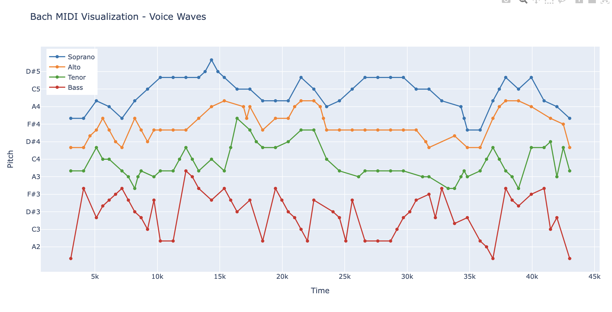

# Analysis of Bach's BWV 273: "Christ, der du bist der helle Tag"

This repository contains a visualization and analysis of Bach's chorale BWV 273. The visualization tools help reveal the intricate voice leading and compositional techniques used in this piece.



## Voice Leading Analysis

The visualization clearly shows the four-part writing characteristic of Bach's chorales, with each voice maintaining its distinct range:

1. **Soprano** (Blue line)
   - Occupies the highest register (F#4 to D#5)
   - Features the most elaborate melodic movement
   - Shows clear melodic phrases with beautiful arching contours
   - Notable climax around the middle section (15k mark)

2. **Alto** (Orange line)
   - Maintains middle-high register (C4-A4)
   - More restrained movement than Soprano
   - Shows periods of stability (particularly evident in 25k-30k region)
   - Moves in smaller intervals, supporting the harmony

3. **Tenor** (Green line)
   - Occupies middle-low register (A3-G4)
   - Similar to Alto in its restrained movement
   - Acts as a connecting voice between upper and lower registers
   - Maintains smooth voice leading with minimal leaps

4. **Bass** (Red line)
   - Lowest register (A2-A3)
   - Features characteristic large intervallic jumps
   - Provides harmonic foundation through movement between fundamental notes
   - Most angular movement pattern of all voices

## Key Observations

1. **Voice Separation**
   - Strict adherence to voice ranges
   - No crossing between voices, maintaining clear textural layers
   - Each voice maintains its own distinct melodic space

2. **Melodic Interaction**
   - Voices show coordinated activity and rest periods
   - When one voice is active, others often provide stable support
   - Creates a conversation-like interplay between parts

3. **Structural Features**
   - Climactic moments (35k-40k) show increased activity in all voices
   - Wave-like patterns characteristic of Bach's style
   - Natural flow between rising and falling movements
   - Balance between melodic interest and harmonic stability

## Technical Implementation

This analysis uses Python with the following libraries:

- `mido` for MIDI file processing
- `plotly` for interactive visualization
- `numpy` for data manipulation

The visualization tools in this repository allow for:
- Interactive exploration of voice movements
- Clear view of melodic contours
- Analysis of voice relationships and patterns

## Usage

1. Install requirements:
```bash
pip install -r requirements.txt
```

2. Run the visualization:
```bash
python visualize_midi.py
```

This will generate an interactive plot showing the movement of all four voices through the piece.
